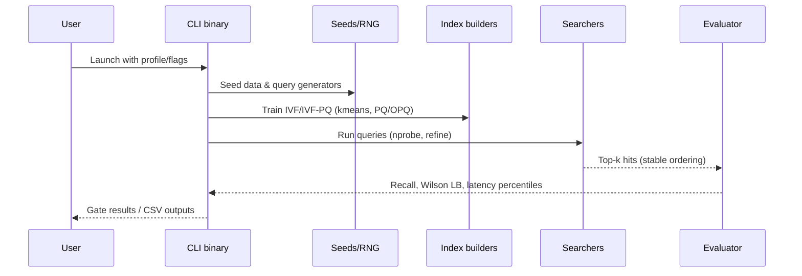

# Architecture

## Overview
raggedy_anndy provides deterministic approximate nearest neighbor (ANN) building blocks and CLI tooling. The binaries in `bin/` orchestrate dataset generation, index training, evaluation, and sweeps on top of the reusable library in `src/`. Runtime and default parameters live in `profiles/`, while `test/` contains integration coverage to keep pipelines stable.

## Repository layout
- **`src/`** — Core library exposing index implementations, metric helpers, deterministic seeding, and utilities reused by binaries.
- **`bin/`** — Command-line entrypoints that wire together dataset creation, indexing, search, and reporting for different workflows (freeze, sweep, ingest, UI/experiments).
- **`profiles/`** — TOML configuration templates consumed by the binaries/Makefile to provide reproducible defaults for runs.
- **`test/`** — Integration tests that exercise end-to-end flows and serve as regression gates alongside the command binaries.

## Core modules (selected)
- **`src/metric.rs`** — Metric enum plus scoring helpers (`score`, `l2_distance`, `cosine_sim`) shared by all indexers.【F:src/metric.rs†L1-L40】
- **`src/types.rs`** — Hit representation and `stable_top_k` selection used to produce deterministic top-k results across indexes.
- **`src/seed.rs`** — SplitMix64 RNG to seed training and search consistently.
- **`src/flat.rs`** — Exact baseline `FlatIndex` with `add` and `search` methods; also reused for IVF refinement and ground truth comparisons.【F:src/flat.rs†L1-L38】
- **`src/kmeans.rs`** — Seeded k-means++ trainer (`kmeans_seeded`) that underpins IVF coarse quantizers.
- **`src/ivf.rs`** — IVF-Flat index (`IvfIndex`) with centroid training, list assignment, delete/upsert, and coarse search plus refine path.【F:src/ivf.rs†L1-L74】
- **`src/pq.rs` & `src/opq.rs`** — Product quantization and optional OPQ permutations/PCA for compressed residual encoding.
- **`src/ivfpq.rs`** — IVF-PQ index (`IvfPqIndex`) combining IVF coarse search with PQ/OPQ encoding and optional refinement.
- **`src/par.rs`** — Parallel helpers (`parallel_map_indexed`) used by binaries to fan out query evaluation.
- **`src/header.rs` & `src/persist.rs`** — Index fingerprints plus optional serialization/deserialization support.
- **`src/context.rs` & `src/time_index.rs`** — Context-aware keys and time-bucketed index wrapper used by experimental UI paths.

## Command wrappers (binaries)
- **`bin/freeze.rs`** — Runs a single configuration with deterministic synthetic data, builds an IVF-Flat or IVF-PQ index, and enforces recall/latency thresholds as a CI gate.【F:bin/freeze.rs†L1-L111】
- **`bin/sweep.rs`** — Performs grid searches over IVF-Flat/IVF-PQ parameters, parallelizes query evaluation, and writes CSV summaries with Wilson bounds for gating or exploration.【F:bin/sweep.rs†L1-L96】
- **`bin/ingest.rs`** — Demo embedder that normalizes/encodes text rows into vectors for downstream indexing.
- **`bin/build_index.rs`** — Utility to train and persist indexes from provided vectors (pairs with `persist.rs`).
- **`bin/rn_ui.rs` & `bin/context_test.rs`** — Experimental runtime + context harnesses built on `context.rs` and `time_index.rs` abstractions.
- **`bin/sweep.rs` & `bin/freeze.rs`** consume profile defaults (via Makefile/profiles) but allow CLI overrides for seeds, probe counts, and refinement depth.

## Data flow
1. **Configuration** — Users start with `profiles/default.toml` defaults; binaries read these (or CLI flags) to set dataset sizes, metrics, PQ params, and threading.
2. **Synthetic or ingested data** — `freeze`/`sweep` generate deterministic vectors via seeded RNGs, while `ingest` converts external text/embeddings.
3. **Index build** — Core builders (`FlatIndex::add`, `IvfIndex::build`, `IvfPqIndex::build`) train coarse centroids (k-means), encode residuals (PQ/OPQ), and store ids/tags.
4. **Search** — Queries flow through coarse selection (nprobe lists), optional refinement via `FlatIndex`, and scoring through `metric::score` and `stable_top_k` to ensure deterministic ordering.【F:src/flat.rs†L22-L38】【F:src/ivf.rs†L21-L74】
5. **Evaluation** — Binaries collect recall against the exact flat baseline, compute Wilson lower bounds (`eval.rs`), and measure latency percentiles. Failures trigger non-zero exits for CI gates.
6. **Persistence & fingerprints** — When enabled, headers from `header.rs` embed seeds/config to validate determinism; `persist.rs` can serialize/deserialize trained structures for reuse.

## Tests and quality gates
- **`test/`** hosts integration scaffolding; combined with `freeze` thresholds, it ensures pipelines remain deterministic and performant. Adding new features should extend integration coverage and align profile defaults so CI gates remain meaningful.

## Diagrams
### Module relationships
```mermaid
flowchart TD
    bin[CLI binaries\n(freeze/sweep/ingest/...)] --> lib[Core library (src/)]
    lib --> metric[metric.rs]
    lib --> types[types.rs]
    lib --> flat[flat.rs]
    lib --> ivf[ivf.rs]
    lib --> ivfpq[ivfpq.rs]
    ivfpq --> pq[pq.rs]
    ivfpq --> opq[opq.rs]
    lib --> context[context.rs/time_index.rs]
    lib --> persist[header.rs/persist.rs]
```

### Runtime flow (freeze/sweep)
